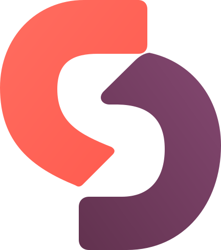

<p align="center">
  
</p>

# 🔥 Builder Development Framework (BDF) + Switcher App

> **Learn the engineering process once. Reuse it forever.**
>
> A reusable engineering platform that builds configuration builders for **any
> open-source coding agent** - currently OpenCode and KiloCode - plus a **GUI
> app that performs the exact same work automatically** for people who never
> want to touch JSON, PowerShell, or an AI agent.
>
> Built by a learner, for learners. Free. Local-first. No account, no cloud,
> nothing leaves your PC.

[-2ea44f)](#-what-is-this--two-worlds-one-engine)
[](#-what-is-this--two-worlds-one-engine)
[](#-development-setup-structure-testing)
[](#-releases)
[](#-roadmap)

---

## 🎬 See it in action

The whole flow, from first launch to build - all local, nothing leaves 127.0.0.1:

| | |
|---|---|
| **Onboarding wizard** - welcome, agent discovery, review, ready | **Overview dashboard** - provider relay + live activity graphs |
|  |  |
| **Provider deck + add wizard** - SDK, reasoning format, custom providers | **Activity & API logs** - filters, charts, token tracking |
|  |  |
| **Settings** - profile switcher, per-model reasoning panel | **Integrations** - plugins + MCP servers (local/remote/expert) |
|  |  |

The dashboard manages your coding agent(s) - providers, plugins, MCP servers,
models, and the build - all on your machine, nothing leaves 127.0.0.1:

The Overview page runs on real data: a scrollable provider relay (scroll to
cycle your providers with a depth animation), live activity KPIs from the
local proxy log, honest empty states when there's no traffic, and an active-
agent chip in the header. Main providers show their real bundled logos;
custom providers get a generated one.

---

## 🚀 Quick start

Three ways to get it, depending on what you want:

### 1. Everything - the BDF framework + the Switcher app

```powershell
git clone https://github.com/lovkumarLED/Builder-Development-Framework-BDF.git
cd Builder-Development-Framework-BDF\app
python -m venv env
env\Scripts\pip install -r requirements.txt
env\Scripts\python server.py
```

### 2. Only the app (the GUI - smallest download)

```powershell
git clone --depth 1 --filter=blob:none --sparse https://github.com/lovkumarLED/Builder-Development-Framework-BDF.git
cd Builder-Development-Framework-BDF
git sparse-checkout set app
cd app
python -m venv env
env\Scripts\pip install -r requirements.txt
env\Scripts\python server.py
```

### 3. Only the BDF framework (the docs + templates - no app)

```powershell
git clone --depth 1 --filter=blob:none --sparse https://github.com/lovkumarLED/Builder-Development-Framework-BDF.git
cd Builder-Development-Framework-BDF
git sparse-checkout set bdf
```

**For normal people (use the app):** no terminal needed, I promise.

1. Install **Python** on Windows (tick *"Add python.exe to PATH"*).
2. Double-click **`app\install.bat`** once. It creates the app's own
   Python environment (`env\`), installs its packages (one-time, needs
   internet), and puts an **"Switcher"** shortcut on your desktop.
3. From now on, double-click the desktop shortcut (or `app\start.bat`) - your
   browser opens **`http://127.0.0.1:9090`**. Follow the wizard.
4. Close the window = the app stops. It is not a background service.

All three downloads were tested from a fresh clone: the app-only install boots
the full modern GUI, the framework-only install gets every bdf/ doc + template,
and the full clone gets both. Your API keys never leave your machine - the
app only stores them in your own agent's provider files, and the proxy on
`127.0.0.1:9090` is the only "cloud" involved.


**For developers (use the framework):**

```powershell
# Discover what's installed
powershell -File scripts\scaffold-agent.ps1 -List

# Scaffold an agent (scan main JSON → seed profiles → generate builder scripts)
powershell -File scripts\scaffold-agent.ps1 -Agent kilo -NonInteractive -Bootstrap

# Build the agent's config from the modular sources
powershell -File C:\Users\You\.config\kilo\scripts\build-kilo-v1.ps1 -Profile coding -NonInteractive
```

---

## Table of Contents

1. [What is this? — Two worlds, one engine](#-what-is-this--two-worlds-one-engine)
2. [Key features](#-key-features)
3. [The Story Behind the Project](#-the-story-behind-the-project)
4. [One Last Thing...](#-one-last-thing)
5. [Architecture](#-architecture)
6. [How the BDF engine works](#-how-the-bdf-engine-works)
7. [How the Switcher app works](#-how-the-switcher-app-works)
8. [Agent management](#-agent-management)
9. [Providers, models, plugins, MCP — the data model](#-providers-models-plugins-mcp--the-data-model)
10. [The GUI: screens, theme, animations, assets](#-the-gui-screens-theme-animations-assets)
11. [Development: setup, structure, testing](#-development-setup-structure-testing)
12. [Roadmap](#-roadmap)
13. [Documentation map](#-documentation-map)
14. [Releases](#-releases)
15. [License](#license)

---

## ✨ Key features

- **Two worlds, one engine.** The BDF builders (`build-kilo-v1.ps1`,
  `build-opencode-v2.7.ps1`) read your `providers/` and `profiles/`, validate
  everything against JSON schemas, back up before they touch anything, merge,
  and generate the final config - with a dry-run (`-WhatIf`), a doctor
  (`-Doctor`), and a provenance sidecar so you always know what happened and
  why. The Switcher app is a GUI on top of that same engine - it never
  re-implements it, it calls it.
- **Wizard setup for your agents.** The wizard discovers your agents, scans
  their configs, and generates their builders. One dashboard shows your
  agents, providers, models, plugins, and MCP servers. Manage **many agents
  at once** (`state.json` registry) and switch between them instantly - the
  whole app re-routes.
- **Dual-key provider files.** Every provider file is written for **both**
  agent contracts: OpenCode reads `provider.<id>.apiKey`, KiloCode reads
  `provider.<id>.options.apiKey`. One save works in every agent, and the
  builders mirror hand-written keys automatically at merge time.
- **Provider presets that auto-fill.** Add-provider presets for my local
  proxies (OmniRoute, LiteLLM), TokenRouter, OpenAI, Google Gemini,
  OpenRouter, NVIDIA NIM - picking one fills the URL, the SDK package (15
  registry-verified packages), the name, and the reasoning format
  (OpenAI/ChatGPT → low/medium/high/xhigh, Claude → thinking budgets,
  Gemini → thinking budgets, OpenCode → default/minimal/high/max).
- **Backup-first, every write.** Providers, models, plugins, MCP, settings -
  everything is copied to the agent's `backup\` folder before it changes,
  with SHA256-hash-verified snapshot/restore for testing.
- **Local-first, No-Secrets.** The server binds `127.0.0.1` only. Keys live
  only in the user's own provider files - never in code, logs, examples, or
  API responses. The proxy on `127.0.0.1:9090` is the only "cloud" involved.
- **The jsonc HARD RULE.** The framework ONLY scans the main `.json`. It
  never scans, merges, reads, or modifies any `.jsonc` file - ever. A
  `.jsonc` is never imported and never emptied.

---

## 🧭 What is this? — Two worlds, one engine

**This project is that way.** It has two halves that share one engine:

- **The BDF builders** (`build-kilo-v1.ps1`, `build-opencode-v2.7.ps1`): they read your `providers/` and `profiles/`, validate everything against JSON schemas, back up before they touch anything, merge, and generate the final config - with a dry-run (`-WhatIf`), a doctor (`-Doctor`), and a provenance sidecar so you always know what happened and why.

- **The Switcher app**: a GUI on top of that same engine. The wizard discovers your agents, scans their
  configs, and generates their builders. One dashboard shows your agents, providers, models, plugins, and MCP
  servers. The Add-provider form carries presets - my local proxies (OmniRoute, LiteLLM), TokenRouter,
  OpenAI, Google Gemini, OpenRouter, NVIDIA NIM - that auto-fill the URL, the SDK, the name, and the
  reasoning format (OpenAI/ChatGPT → low/medium/high/xhigh, Claude → thinking budgets, Gemini → thinking
  budgets, OpenCode → default/minimal/high/max). Test a connection, switch the active provider, hit build:
  done. The builders ask the same question on the command line for developers.

Every provider file is written for **both** agent contracts (dual-key), backups are made first, and keys never leave your machine - the proxy on `127.0.0.1:9090` is the only "cloud" involved.

---

## 📖 The Story Behind the Project

It started with a pretty simple problem: **too many API keys, too many providers, and configuration files that kept growing.** 😅

I'm just a normal guy trying to learn **Python and Machine Learning** - intermediate Python so far, still working my way toward the ML part of the journey. To learn without spending a fortune, I hunted down every free model and free API I could find. Different providers, different coding agents, different websites - anything that gave me more useful AI tools.

And it worked. Maybe too well.

Before long I had a drawer full of API keys, provider files, model lists, MCP servers, plugins, and profiles. My JSON configs were getting bigger and bigger - and the real kicker is that **every agent reads them differently**. OpenCode reads a provider key from `provider.<id>.apiKey`, KiloCode reads it from `provider.<id>.options.apiKey`. One provider file, two contracts. And a stray `opencode.jsonc` can silently shadow the config you just spent an hour building.

At some point I thought:

> **"There has to be a better way to manage all of this."**

So I built one.

I didn't know how to build any of this when I started. I know Python, but I had never built a web app, and the builders are PowerShell - a language I don't speak at all. So I built them with the help of **coding agents**, one experiment at a time: days of debugging, breaking things, fixing them, and slowly figuring out how the pieces fit together. That's what made it fun.

A narrow Claude Code routing adapter is now **live validated** (see `adapters/claude-code/`) - it manages one scalar route at a time and preserves everything Claude owns.

I'm not finished. Claude Code and more providers are on the list. But right now, this is the system I built because I actually needed it - and if you like it, you're welcome to contribute. That would make me genuinely happy. ❤️

---

### 😄 One Last Thing...

If you ever wonder why the generated JSON files - kilo.json, opencode.json - look completely cursed after running a builder...

**Just press `Shift + Alt + F`.**

You're welcome. 😂

---

## 🏗 Architecture

### System overview

```
Browser (gui.html, one file: HTML + CSS + vanilla JS + local Anime.js)
        │  fetch()  (relative paths, same origin)
        â–¼
FastAPI server (server.py on 127.0.0.1:9090 — LOCAL ONLY)
        │
        ├── /api/*   — the app's own API (agents, discover, scan, providers,
        │              models, plugins, mcp, test, switch, scaffold, build, rules)
        ├── /v1/*    — OpenAI-compatible proxy → the ACTIVE provider
        ├── /lib     — static: anime.min.js (local, no CDN)
        └── /assets  — static: logo + favicon
        │
        â–¼
app/ package (modular Python: one responsibility per module)
        │
        â–¼
The agent's real config folder (e.g. C:\Users\You\.config\kilo)
   ├── kilo.json                 ← generated by the builder (never hand-edited)
   ├── providers\<id>.json       ← app-managed provider files (backup-first;
   │                               may carry reasoningFormat: opencode | openai |
   │                               claude | gemini | none)
   ├── profiles\coding\
   │     ├── settings.json       ← activeProviders list (the builder's source)
   │     ├── <provider>-models.json   ← model variants follow the provider's
   │     │                             reasoning format (reasoningEffort,
   │     │                             thinking.budgetTokens, or
   │     │                             thinkingConfig.thinkingBudget)
   │     ├── plugins.json
   │     ├── lsp.json            ← LSP on/off + value (disabled by default)
   │     └── mcp.json
   ├── scripts\build-<agent>.ps1 ← generated builder (created by the app's
   │                               bundled engine, app\engine\scaffold-agent.ps1)
   └── backup\                   ← every write is backed up here first
```

The app is fully self-contained: `app\engine\` ships the generator, both
builders + testers, and the schemas, so a downloaded copy creates everything
above for OpenCode or Kilo with zero external setup.

### Request flow — one example end to end

```
User clicks "Test" on a provider card
  → POST /api/test {id}
    →     `app/app/testing.py` reads providers\<id>.json via app/app/agentstore.py
    → GET <baseUrl>/v1/models with Authorization: Bearer <key>
    → {ok, message, latencyMs} → the card dot turns green
```

### The backend modules (`docs/app/app/`)

| Module | Responsibility |
|--------|----------------|
| `activity.py` | `/api/activity` and `/api/activity/summary`: bounded, privacy-safe local proxy metadata |
| `preferences.py` | `/api/preferences`: local retention and reduced-motion preference; redaction remains mandatory |
| `server.py` | entry point: mounts static dirs, includes all routers, starts uvicorn, prints the banner |
| `config.py` | paths, host/port, and app-owned runtime-data locations |
| `banner.py` | local startup banner and local addresses |
| `storage.py` | `state.json` persistence (atomic writes) |
| `agents.py` | `/api/agents` — register/remove/switch which agent the app manages |
| `discovery.py` | `/api/status`, `/api/discover`, `/api/scan` — find agents, read their main JSON read-only |
| `agentstore.py` | **the heart**: reads/writes the agent's real BDF files (providers, models, plugins, mcp, settings), backups, builder discovery, agent registry logic |
| `providers.py` | `/api/providers` CRUD + `/api/switch` + models writing |
| `engine.py` | `/api/scaffold` (runs the **bundled** `app/engine/scaffold-agent.ps1 -Bootstrap` - self-contained, nothing lives outside the repo) + `/api/build` (runs the agent's generated builder) |
| `testing.py` | `/api/test` — connection tester (GET /v1/models) |
| `plugins.py` | `/api/plugins` — profile plugin list |
| `mcp.py` | `/api/mcp` — profile MCP servers |
| `proxy.py` | `/v1/*` — OpenAI-compatible passthrough to the ACTIVE provider |
| `serve.py` | `GET /` (gui.html), `GET /api/rules` — serves the GUI with the rule.md theme injected |
| `rules.py` | parses `rule.md` (theme front-matter + rulebook), never crashes, defaults on bad input |

---

## 🔄 How the BDF engine works

The framework's ONE job, the same for ANY open-source coding agent — no
exceptions, no special cases:

1. **Discover** the agent's config location (registry: opencode, kilo, aider,
   goose, codex-cli, ... — add more by extending `$AgentRegistry` in
   `scripts/scaffold-agent.ps1`).
2. **Scan** the agent's OWN main JSON first, read-only. Never another agent's
   config, never `.jsonc` without consent.
3. **Split** the main config into sections: `mcp`, `plugin`, `lsp`, `settings`
   (providers are detected for guidance only).
4. **Seed** the three profiles — `coding` (the main) + `experimental` +
   `minimal` — each with exactly `settings.json`, `mcp.json`, `plugins.json`,
   `lsp.json`.
   `mcp.json`/`plugins.json`/`lsp.json` are user-owned after creation — the
   framework NEVER overwrites them. LSP is disabled by default
   (`enabled: false`) until you turn it on.
5. **Generate the builder scripts** (`build-<agent>.ps1`,
   `test-<agent>.ps1`, `scaffold-<agent>.ps1`) via `-Bootstrap`, adapted from
   the reference builders.
6. **Keep providers/models user-owned**: the framework creates the
   `providers/` folder but never writes files inside it. (The **app** writes
   them on the user's behalf, backup-first.)

The generated builders all share one pipeline:

```
F1 JSON Schema validation → F2 pre-flight dependency check → merge stages
(settings → providers → models → plugins → mcp → lsp) → output verification →
backup retention → provenance sidecar → merge-diff summary
```

- `-WhatIf` = dry run (validate + merge, never write).
- `-Doctor` = read-only diagnostics of the real config.
- `activeProviders` (from `settings.json`) decides **which** providers merge;
  a provider with **no models is dropped** (the model guard).
- **Dual-key normalization** happens in the provider merge stage: if a
  provider file carries `apiKey` but no `options.apiKey`, the builder mirrors
  it automatically — the app and hand-written providers produce the same
  output. Builder-only users get the same result as app users (no ups and
  downs between the two worlds).

---

## 🤖 How the Switcher app works

### The core idea

The app is BDF made autonomous. It never re-implements the engine — it calls
it. That's the whole trick, honestly:

- `POST /api/scaffold` → runs `scaffold-agent.ps1 -Agent <agent> -ConfigRoot <dir>
  -NonInteractive -Bootstrap` → profiles + builder scripts.
- `POST /api/build` → runs the agent's real `build-<agent>*.ps1 -Profile coding
  -NonInteractive` (it finds `build-kilo-v1.ps1` too).

### The agent registry (`state.json`)

The app can manage **many agents at once**:

```json
{
  "agent": "kilo",
  "dir": "C:\\Users\\loveb\\.config\\kilo",
  "agents": [
    { "name": "kilo",      "dir": "C:\\Users\\loveb\\.config\\kilo" },
    { "name": "opencode",  "dir": "C:\\Users\\loveb\\.config\\opencode" }
  ],
  "activeAgent": "kilo"
}
```

- `agents` — every registered agent (name + config folder).
- `activeAgent` — the one being managed right now. **Every** `/api/*` call
  operates on the active agent via `agentstore.current_agent()`.
- Legacy `{agent, dir}` keys are auto-migrated to the registry on first use.

### Readiness — when the wizard appears

An agent is **ready** if its `scripts\` folder contains any `build-*.ps1`
(`agentstore.has_any_builder`). `/api/status` reports `ready` for the active
agent:

- ready → the app boots straight to the dashboard.
- not ready → the wizard. **Adding an already-set-up agent skips the wizard
  entirely** (the app detects the builder and loads it immediately).
- the wizard's "Looks good — open it →" button also uses this check to skip
  re-scaffolding.

### The active-provider list

`profiles\coding\settings.json` holds `activeProviders` — a **list**. Every
provider in the list is merged into the build (each with its own models). The
**first** one is the *primary*:

- the `/v1` proxy forwards to the primary,
- "Switch to this" moves a provider to the front (all stay in the build),
- saving a new provider does not activate it; activation is always the explicit
  **Switch provider** action.

### The proxy (`127.0.0.1:9090/v1`)

Any OpenAI-compatible tool can point at the app once. `app/app/proxy.py` reads the
active agent's settings → takes the primary provider → forwards every
`/v1/*` request with `Authorization: Bearer <key>` (SSE streaming passes
through). Switching providers = one click in the GUI, zero tool reconfiguration.

Each upstream attempt creates an app-owned local Activity event containing only
timestamp, generated trace ID, provider/model IDs, route/method, status,
latency, optional numeric token counts, and a sanitized error category. It
never persists prompts, messages, responses, response content, API keys,
authorization headers, or raw request/response bodies. Streaming events retain
null token counts; all Activity data stays on the PC.

---

## 🧩 Agent management

| Action | What happens |
|--------|--------------|
| **Add agent** | `POST /api/agents {name, dir}` → validated (folder must exist) → registered → auto-switched → `ready` returned |
| **Switch** | `POST /api/agents/switch {name}` → `activeAgent` changes → the whole app re-routes (providers, models, plugins, MCP, build follow) |
| **Remove** | `DELETE /api/agents/{name}` → removed from the registry (files untouched) → falls back to the next agent, or the wizard if none remain |
| **Wizard scaffold** | registers the agent too (`upsert_agent`) |

Every add/remove/switch re-checks `/api/status` and re-renders the dashboard —
no page refresh needed.

---

## 🧩 Providers, models, plugins, MCP — the data model

All data lives in the **agent's own config** (BDF-style). The app never keeps
a private copy.

### Provider file — `providers\<id>.json`

```json
{
  "id": "tokenrouter",
  "provider": {
    "tokenrouter": {
      "name": "TokenRouter",
      "apiKey": "sk-...",                    ← OpenCode reads this
      "options": {
        "baseURL": "https://api.tokenrouter.com/v1",
        "apiKey": "sk-..."                   ← Kilo reads this (dual key)
      },
      "npm": "@ai-sdk/openai-compatible",    ← SDK type
      "models": {}
    }
  }
}
```

**The dual key is the compatibility contract.** Different agents read the key
from different fields: **OpenCode** reads `provider.<id>.apiKey`, **Kilo**
reads `provider.<id>.options.apiKey`. The app writes **both** — one save works
in every agent. Hand-written provider files get the same treatment: the
builders mirror `apiKey` into `options.apiKey` automatically at merge time
(the "Dual-key" line in the build log), so builder-only users get the same
result as app users.

The **SDK type** (`npm`) is chosen from a dropdown of 15 registry-verified
packages: `@ai-sdk/openai-compatible` (default — fits OmniRoute, LiteLLM, CLI
proxies, TokenRouter, Modal, NVIDIA NIM, any local gateway),
`@ai-sdk/openai`, `@openrouter/ai-sdk-provider`, `@ai-sdk/anthropic`,
`@ai-sdk/google`, `@ai-sdk/mistral`, `@ai-sdk/xai`, `@ai-sdk/deepseek`,
`@ai-sdk/groq`, `@ai-sdk/perplexity`, `@ai-sdk/togetherai`,
`@ai-sdk/cerebras`, `@ai-sdk/azure`, `@ai-sdk/amazon-bedrock`,
`@ai-sdk/cohere` — or a custom package name.

### Real providers — not just proxies

The app started as a proxy switcher (OmniRoute, LiteLLM, CLI Proxy), and that
still works exactly as before. **Real, legitimate providers work the same
way**: the Add-provider form has presets for **TokenRouter, Modal, OpenAI,
Google (Gemini), OpenRouter, and NVIDIA NIM** — picking a preset fills the
base URL *and* the SDK package automatically, then it's key → test → save →
build → chat in your agent. (For Modal, paste your own endpoint URL — every
account has its own — and use the combined proxy token `wk-…ws-…` as the
key.)

### Models — `profiles\coding\<provider>-models.json`

```json
{
  "models": {
    "moonshotai/kimi-k3-free": {
      "name": "Kimi-K3",
      "variants": {
        "default": { "reasoningEffort": "default" },
        "minimal": { "reasoningEffort": "minimal" },
        "high":    { "reasoningEffort": "high" },
        "max":     { "reasoningEffort": "max" }
      }
    }
  }
}
```

Added from the provider modal or the **Models card** (pick a provider → rows
with thinking chips). Providers **without models are skipped by the build** —
the app warns about this.

### Plugins & MCP — `profiles\coding\plugins.json` / `mcp.json`

- Plugins: `{ "plugin": ["superpowers@git+https://github.com/obra/superpowers.git"] }`
  — the Plugins card add/remove, deduped.
- MCP: `{ "mcp": { "context7": { "type": "local", "command": ["npx", "-y", ...] } } }`
  — the MCP card, with JSON validation (bad config = friendly inline error).
- LSP: `{ "lsp": true, "enabled": false }` — the Integrations page LSP block
  (between Plugins and MCP) turns LSP on; the builder then carries the `lsp`
  value into the generated config. Disabled by default.

### Safety invariants (the rules)

- **No-Secrets:** keys live only in the user's own provider files — never in
  code, logs, examples, or API responses (`hasKey` only on GET).
- **Backup-first:** every write (provider, models, plugins, mcp, settings) is
  copied to the agent's `backup\` folder first.
- **Local-first:** the server binds `127.0.0.1` only.
- **Merge, never clobber:** unknown content in existing files is preserved.

### Rules for users (what NOT to do)

- **Never hand-edit your agent's main config** — `opencode.json` / `kilo.json`
  are *generated* by the builder from `providers\` + `profiles\`. Edit a
  provider or model in the app and rebuild instead; hand edits are overwritten
  by the next build.
- **Never create `opencode.jsonc` next to `opencode.json`.** OpenCode reads
  the `.jsonc` *instead of* the `.json` when both exist — your built config
  silently disappears from `/models`. (Same trap: a stale `kilo.jsonc`.)
  The app and the builder target `opencode.json` today; generating both
  formats is planned for a future update — not right now.

---

## 🎨 The GUI: screens, theme, animations, assets

### Screens (one HTML file, shown/hidden by JS)

- **Setup wizard** — welcome → agent location → scanning → found cards →
  generate/open. Progress bar, slide transitions.
- **Dashboard** — Agents card, the glowing active-hero (every active provider
  side-by-side), provider cards (switch/test/edit/delete), Plugins, MCP
  servers, Models cards, Build panel, Advanced panel.

### The theme engine — `rule.md`

`docs/app/rule.md` has **two jobs**:

1. **Theme** (YAML front-matter): the app injects these as CSS variables into
   the page at serve time (`app/app/rules.py` → `app/app/serve.py`). Edit a color,
   save, refresh — the app updates. Invalid values fall back to defaults; the
   parser never crashes.
2. **Rulebook** (markdown): the design/feature/architecture rules AI agents
   must follow when changing the app.

### Animations

The GUI animates with a local copy of Anime.js (no CDN, works offline) and
respects `prefers-reduced-motion`. Subtle touches only - staggered entrances,
toasts, and the ember particles in the background.

### Assets & images

| File | Purpose |
|------|---------|
| `app/assets/bdf-counterphase-logo.svg` | the Switcher brand logo (app favicon + README header) |

To add images: put them in `app/assets/` and reference them with relative
paths (`src="assets/my-image.png"`) — the server serves `/assets` statically.
Never hot-link external images (local-first, offline-friendly).

---

## 🛠 Development: setup, structure, testing

### Setup

```powershell
cd app
python -m venv env                 # or just run start.bat once — it does this
env\Scripts\python -m pip install -r requirements.txt
env\Scripts\python server.py       # runs on http://127.0.0.1:9090
```

Adding a dependency? Put it in `requirements.txt` — start.bat re-installs
automatically (SHA256 hash marker detects the change).

### Where things live

```
docs/
├── app/                    ← the Switcher app (self-contained)
│   ├── app/                ← Python package (see module table above)
│   ├── tests/              ← 48 unit tests (unittest, stdlib-only)
│   ├── assets/             ← logo + favicon
│   ├── lib/                ← anime.min.js (local)
│   ├── gui.html            ← the whole frontend (one file)
│   ├── rule.md             ← theme + rulebook
│   ├── server.py / start.bat / requirements.txt
│   └── README.md           ← plain-language user guide
├── scripts/                ← scaffold-agent.ps1 (the engine), the builders
├── bdf/                    ← the framework docs + templates
├── _agent/                 ← session log, journey tracker
└── AI/                     ← build plans, continuation files
```

### Testing

**Unit tests** (fast, isolated — they never touch your real config):

```powershell
cd app
env\Scripts\python -m unittest discover -s tests
```

Covers: rules parsing, theme injection, and the agent store (providers,
models, plugins, MCP, settings merge, agent registry, backups).

**End-to-end battery** (the way session 29 tested everything):

1. **Snapshot** the real agent config to a temp folder (every file) + the
   app's `state.json`.
2. Click through every button in a real browser.
3. **Restore** the snapshot and hash-verify every file is byte-identical
   (compare against a manifest captured before the test).

This is the safe way to test write features on a real config — the snapshot +
hash manifest is your undo button.

**Frontend checks:** after editing `gui.html`, extract its inline `<script>`
and run `node --check` on it.

### Conventions

- Modular backend: one responsibility per module, clear interfaces.
- BDF-exact data model: the app reads/writes the agent's own files.
- No-Secrets, backup-first, local-first — always.
- README sync rule: any user-visible change must be reflected in the READMEs
  in the same change.
- Commit only when asked; conventional commit style (`feat(app):`, `docs:`).

---

## 🧭 Roadmap

**13 of 15 phases complete** toward **BDF V3** — the first stable public
version that generates builders for OpenCode, KiloCode, and any
same-architecture open-source coding agent. Phase 13 (BDF V3) is in progress.

| Phase | Status |
|-------|--------|
| Phase 1 — Foundation | ✅ |
| Phase 2 — Builder Improvements | ✅ |
| Phase 3 — Multiple Profiles | ✅ |
| Phase 4 — Additional Providers | ✅ |
| Phase 5 — Validation Framework | ✅ |
| Phase 6 — Automated Testing | ✅ |
| Phase 7 — Builder Refactoring | ✅ |
| Phase 8 — Documentation Expansion | ✅ |
| Phase 9 — Release Manager V1 | ✅ |
| Phase 10 — BDF V2.5 Framework Generalization | ✅ |
| Phase 10.5 — Active-Provider Selector Builder | ✅ |
| Phase 10.6 — JSON Schema Validation | ✅ |
| Phase 11 — Claude Code Builder V1 | ✅ resolved (dropped) |
| Phase 12 — KiloCode Builder V1 | ✅ |
| Phase 13 — BDF V3 Universal Builder Generator | 🔄 in progress |
| Phase 14 — GUI App (Switcher) | ✅ |
| Phase 15 — More Coding Agents | 🔜 planned (untested) |

**Phase 15 note:** OpenCode + KiloCode are verified today. The app and the
universal scaffold are expected to work with **more open-source coding
agents** — untested yet; we will find out when we try them.

---

## 📚 Documentation map

| Area | Documents |
|------|-----------|
| Project | `AGENT.md`, `ARCHITECTURE.md`, `BUILDER_SPEC.md`, the 4 onboarding guides, `FOLDER_STRUCTURE.md`, `JSON_SCHEMAS.md`, `TESTING.md`, `TROUBLESHOOTING.md`, `ROADMAP.md`, `CHANGELOG.md`, `PROJECT_STATE.md`, `ADAPTER.md` |
| App | `app/README.md` (plain-language user guide), `app/rule.md` (theme + rulebook) |
| Framework | `bdf/FRAMEWORK.md`, `bdf/AI_WORKFLOW.md`, `bdf/PROJECT_ADAPTER.md`, `bdf/BUILDER_*`, `bdf/templates/` (19 templates) |
| Session & planning | `_agent/SESSION_WORKFLOW.md`, `_agent/SESSION_LOG.md`, `_agent/JOURNEY_TO_V3.md`, `planning/`, `AI/` |

---

## 📦 Releases

Current release: **2.5.3** (Builder V2.7, LSP support). History in
`CHANGELOG.md` + `docs/release_registry.json` (regenerated by
`scripts/release-manager.ps1`).

---

- **Backup before you touch. Never write secrets. Copy verbatim.**

---

Thanks for reading. If this helps one more person learn AI the free way like it
helped me — that's the whole point. ❤️

---

**Version:** 2.5.3
**Builder Version:** V2.7 (JSON Schema Validation)
**Framework Version:** 2.2.10
**Document Version:** 2.5

Documentation Status: Current Implementation

**Version:** 2.5.2

---

## License

MIT License - Copyright (c) 2026 Lov Kumar

Permission is hereby granted, free of charge, to any person obtaining a copy of this software and associated documentation files (the "Software"), to deal in the Software without restriction, including without limitation the rights to use, copy, modify, merge, publish, distribute, sublicense, and/or sell copies of the Software, and to permit persons to whom the Software is furnished to do so, subject to the following conditions:

The above copyright notice and this permission notice shall be included in all copies or substantial portions of the Software.

THE SOFTWARE IS PROVIDED "AS IS", WITHOUT WARRANTY OF ANY KIND, EXPRESS OR IMPLIED, INCLUDING BUT NOT LIMITED TO THE WARRANTIES OF MERCHANTABILITY, FITNESS FOR A PARTICULAR PURPOSE AND NONINFRINGEMENT. IN NO EVENT SHALL THE AUTHORS OR COPYRIGHT HOLDERS BE LIABLE FOR ANY CLAIM, DAMAGES OR OTHER LIABILITY, WHETHER IN AN ACTION OF CONTRACT, TORT OR OTHERWISE, ARISING FROM, OUT OF OR IN CONNECTION WITH THE SOFTWARE OR THE USE OR OTHER DEALINGS IN THE SOFTWARE.

See the [LICENSE](LICENSE) file for the full text.

### Brand protection

The name **"Builder Development Framework"**, **"BDF"**, **"Switcher"**, the logo artwork, and the demo images are **not** part of the MIT grant. You may freely use, modify, and build on the code, but you may not re-publish or sell the project as your own creation, and you may not reuse the name, logo, or brand assets without permission. You are expected to keep the original copyright notice (as the MIT license requires) so the real author is always identifiable.
