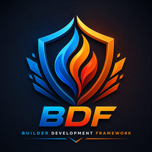
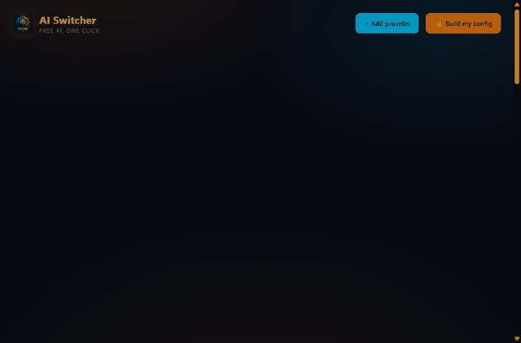
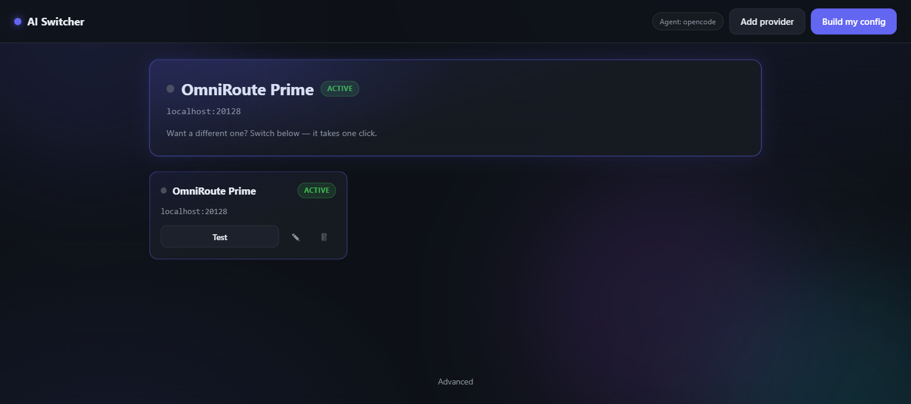
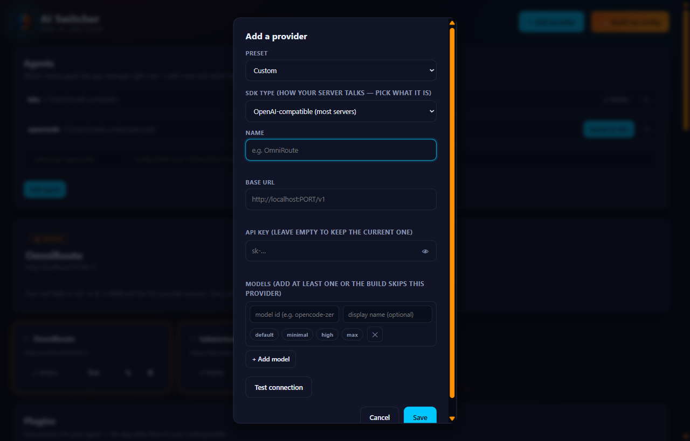

<p align="center">
  
</p>

# 🔥 Builder Development Framework (BDF) + AI Switcher App

> **Learn the engineering process once. Reuse it forever.**
>
> A reusable engineering platform that builds configuration builders for **any
> open-source coding agent** - currently OpenCode and KiloCode - plus a **GUI
> app that performs the exact same work automatically** for people who never
> want to touch JSON, PowerShell, or an AI agent.
>
> Built by a learner, for learners. Free. Local-first. No account, no cloud,
> nothing leaves your PC.

[-2ea44f)](#builder-development-framework)
[](#builder-development-framework)
[](#testing)
[](#releases)
[](#roadmap)

---

## 📖 The Story Behind the Project

It started with a pretty simple problem: **too many API keys, too many providers, and configuration files that kept growing.** 😅

I'm just a normal guy trying to learn **Python and Machine Learning** - intermediate Python so far, still working my way toward the ML part of the journey. To learn without spending a fortune, I hunted down every free model and free API I could find. Different providers, different coding agents, different websites - anything that gave me more useful AI tools.

And it worked. Maybe too well.

Before long I had a drawer full of API keys, provider files, model lists, MCP servers, plugins, and profiles. My JSON configs were getting bigger and bigger - and the real kicker is that **every agent reads them differently**. OpenCode reads a provider key from `provider.<id>.apiKey`, KiloCode reads it from `provider.<id>.options.apiKey`. One provider file, two contracts. And a stray `opencode.jsonc` can silently shadow the config you just spent an hour building.

At some point I thought:

> **"There has to be a better way to manage all of this."**

So I built one.

**This project is that way.** It has two halves that share one engine:

- **The BDF builders** (`build-kilo-v1.ps1`, `build-opencode-v2.7.ps1`): they read your `providers/` and `profiles/`, validate everything against JSON schemas, back up before they touch anything, merge, and generate the final config - with a dry-run (`-WhatIf`), a doctor (`-Doctor`), and a provenance sidecar so you always know what happened and why.

- **The AI Switcher app**: a GUI on top of that same engine. The wizard discovers your agents, scans their
  configs, and generates their builders. One dashboard shows your agents, providers, models, plugins, and MCP
  servers. The Add-provider form carries presets - my local proxies (OmniRoute, LiteLLM), TokenRouter,
  OpenAI, Google Gemini, OpenRouter, NVIDIA NIM - that auto-fill the URL, the SDK, the name, and the
  reasoning format (OpenAI/ChatGPT → low/medium/high/xhigh, Claude → thinking budgets, Gemini → thinking
  budgets, OpenCode → default/minimal/high/max). Test a connection, switch the active provider, hit build:
  done. The builders ask the same question on the command line for developers.

Every provider file is written for **both** agent contracts (dual-key), backups are made first, and keys never leave your machine - the proxy on `127.0.0.1:9090` is the only "cloud" involved.

I didn't know how to build any of this when I started. I know Python, but I had never built a web app, and the builders are PowerShell - a language I don't speak at all. So I built them with the help of **coding agents**, one experiment at a time: days of debugging, breaking things, fixing them, and slowly figuring out how the pieces fit together. That's what made it fun.

I'm not finished. Claude Code and more providers are on the list. But right now, this is the system I built because I actually needed it - and if you like it, you're welcome to contribute. That would make me genuinely happy. ❤️

---

### 😄 One Last Thing...

If you ever wonder why the generated JSON files - kilo.json, opencode.json - look completely cursed after running a builder...

**Just press `Shift + Alt + F`.**

You're welcome. 😂

## Table of Contents

1. [What is this? — Two worlds, one engine](#-what-is-this--two-worlds-one-engine)
2. [Quick start](#-quick-start)
3. [Architecture](#-architecture)
4. [How the BDF engine works](#-how-the-bdf-engine-works)
5. [How the AI Switcher app works](#-how-the-ai-switcher-app-works)
6. [Agent management](#-agent-management)
7. [Providers, models, plugins, MCP — the data model](#-providers-models-plugins-mcp--the-data-model)
8. [The GUI: screens, theme, animations, assets](#-the-gui-screens-theme-animations-assets)
9. [Development: setup, structure, testing](#-development-setup-structure-testing)
10. [Roadmap](#-roadmap)
11. [Documentation map](#-documentation-map)
12. [Releases](#-releases)

---

## 🚀 What is this? — Two worlds, one engine

**BDF is a builder of builders.** Look, the problem is simple: coding agents
(OpenCode, KiloCode, Aider, Goose, ...) store their configuration in messy
monolithic JSON files that are painful to maintain. So BDF splits that mess into
small, well-defined files — profiles, providers, models, plugins, MCP servers —
and provides builders that re-merge them into the agent's main config, safely
and reproducibly. Every single time.

Everything here has **two surfaces powered by the same engine**
(`scripts/scaffold-agent.ps1` + the generated builders):

| World | Audience | How it drives the engine |
|-------|----------|--------------------------|
| **1 — The MD framework** (`docs/bdf/*.md`) | developers + AI agents | an agent reads the process docs and runs the scaffold/builders |
| **2 — The AI Switcher app** (`docs/app/`) | normal people | the app itself calls the same scaffold + builders through a GUI — no AI agent, no terminal, no JSON editing |

> The app is **not** a separate framework — it is a frontend for this one.
> Anything the framework learns (new agents, new builder features) is
> available to the app automatically.

```
┌─────────────────────────────────────────────┐   ┌─────────────────────────────────────────────┐
│  WORLD 1 — DEVELOPERS (MD framework)        │   │  WORLD 2 — NORMAL USERS (AI Switcher app)   │
│  docs/bdf/*.md define the process           │   │  docs/app/: double-click start.bat → browser │
│  an AI agent builds/maintains builders      │   │  the app scans, seeds, generates, builds     │
└──────────────────────┬──────────────────────┘   └──────────────────────┬──────────────────────┘
                       │  same engine, same behavior                      │
                       ▼                                                  ▼
          ┌───────────────────────────────────────────────────────────────────┐
          │  scripts/scaffold-agent.ps1  +  the generated  build-<agent>.ps1 │
          │  (scan → split → seed profiles → generate builder → build)       │
          └───────────────────────────────────────────────────────────────────┘
```

---

## ⚡ Quick start

**For normal people (use the app):** no terminal needed, I promise.

1. Install **Python** on Windows (tick *"Add python.exe to PATH"*).
2. Double-click **`docs\app\install.bat`** once. It creates the app's own
   Python environment (`env\`), installs its packages (one-time, needs
   internet), and puts an **"AI Switcher"** shortcut on your desktop.
3. From now on, double-click the desktop shortcut (or `docs\app\start.bat`) — your
   browser opens **`http://127.0.0.1:9090`**. Follow the wizard.
4. Close the window = the app stops. It is not a background service.

Prefer commands? From PowerShell:

```powershell
git clone https://github.com/lovkumarLED/Builder-Development-Framework-BDF.git
cd Builder-Development-Framework-BDF\docs\app
.\install.bat   # one-time: creates env\, installs packages, adds the desktop shortcut
```

From then on: double-click the **"AI Switcher"** shortcut (or `start.bat`) - the app is instant.


**For developers (use the framework):**

```powershell
# Discover what's installed
powershell -File scripts\scaffold-agent.ps1 -List

# Scaffold an agent (scan main JSON → seed profiles → generate builder scripts)
powershell -File scripts\scaffold-agent.ps1 -Agent kilo -NonInteractive -Bootstrap

# Build the agent's config from the modular sources
powershell -File C:\Users\You\.config\kilo\scripts\build-kilo-v1.ps1 -Profile coding -NonInteractive
```

---

## 🏗 Architecture

### System overview

```
Browser (gui.html, one file: HTML + CSS + vanilla JS + local Anime.js)
        │  fetch()  (relative paths, same origin)
        ▼
FastAPI server (server.py on 127.0.0.1:9090 — LOCAL ONLY)
        │
        ├── /api/*   — the app's own API (agents, discover, scan, providers,
        │              models, plugins, mcp, test, switch, scaffold, build, rules)
        ├── /v1/*    — OpenAI-compatible proxy → the ACTIVE provider
        ├── /lib     — static: anime.min.js (local, no CDN)
        └── /assets  — static: logo + favicon
        │
        ▼
app/ package (modular Python: one responsibility per module)
        │
        ▼
The agent's real config folder (e.g. C:\Users\You\.config\kilo)
   ├── kilo.json                 ← generated by the builder (never hand-edited)
   ├── providers\<id>.json       ← app-managed provider files (backup-first;
   │                               may carry reasoningFormat: opencode | openai |
   │                               claude | gemini | none)
   ├── profiles\coding\
   │     ├── settings.json       ← activeProviders list (the builder's source)
   │     ├── <provider>-models.json   ← model variants follow the provider's
   │     │                             reasoning format (reasoningEffort,
   │     │                             thinking.budgetTokens, or
   │     │                             thinkingConfig.thinkingBudget)
   │     ├── plugins.json
   │     └── mcp.json
   ├── scripts\build-<agent>.ps1 ← generated builder (created by the app's
   │                               bundled engine, app\engine\scaffold-agent.ps1)
   └── backup\                   ← every write is backed up here first
```

The app is fully self-contained: `app\engine\` ships the generator, both
builders + testers, and the schemas, so a downloaded copy creates everything
above for OpenCode or Kilo with zero external setup.

### Request flow — one example end to end

```
User clicks "Test" on a provider card
  → POST /api/test {id}
    →     `app/app/testing.py` reads providers\<id>.json via app/app/agentstore.py
    → GET <baseUrl>/v1/models with Authorization: Bearer <key>
    → {ok, message, latencyMs} → the card dot turns green
```

### The backend modules (`docs/app/app/`)

| Module | Responsibility |
|--------|----------------|
| `server.py` | entry point: mounts static dirs, includes all routers, starts uvicorn, prints the banner |
| `config.py` | paths, host/port, presets, the agent registry mirror |
| `banner.py` | flame ASCII-art startup banner + local addresses |
| `storage.py` | `state.json` persistence (atomic writes) |
| `agents.py` | `/api/agents` — register/remove/switch which agent the app manages |
| `discovery.py` | `/api/status`, `/api/discover`, `/api/scan` — find agents, read their main JSON read-only |
| `agentstore.py` | **the heart**: reads/writes the agent's real BDF files (providers, models, plugins, mcp, settings), backups, builder discovery, agent registry logic |
| `providers.py` | `/api/providers` CRUD + `/api/switch` + models writing |
| `engine.py` | `/api/scaffold` (runs the **bundled** `app/engine/scaffold-agent.ps1 -Bootstrap` - self-contained, nothing lives outside the repo) + `/api/build` (runs the agent's generated builder) |
| `testing.py` | `/api/test` — connection tester (GET /v1/models) |
| `plugins.py` | `/api/plugins` — profile plugin list |
| `mcp.py` | `/api/mcp` — profile MCP servers |
| `proxy.py` | `/v1/*` — OpenAI-compatible passthrough to the ACTIVE provider |
| `serve.py` | `GET /` (gui.html), `GET /api/rules` — serves the GUI with the rule.md theme injected |
| `rules.py` | parses `rule.md` (theme front-matter + rulebook), never crashes, defaults on bad input |

---

## 🔄 How the BDF engine works

The framework's ONE job, the same for ANY open-source coding agent — no
exceptions, no special cases:

1. **Discover** the agent's config location (registry: opencode, kilo, aider,
   goose, codex-cli, ... — add more by extending `$AgentRegistry` in
   `scripts/scaffold-agent.ps1`).
2. **Scan** the agent's OWN main JSON first, read-only. Never another agent's
   config, never `.jsonc` without consent.
3. **Split** the main config into sections: `mcp`, `plugin`, `settings`
   (providers are detected for guidance only).
4. **Seed** the three profiles — `coding` (the main) + `experimental` +
   `minimal` — each with exactly `settings.json`, `mcp.json`, `plugins.json`.
   `mcp.json`/`plugins.json` are user-owned after creation — the framework
   NEVER overwrites them.
5. **Generate the builder scripts** (`build-<agent>.ps1`,
   `test-<agent>.ps1`, `scaffold-<agent>.ps1`) via `-Bootstrap`, adapted from
   the reference builders.
6. **Keep providers/models user-owned**: the framework creates the
   `providers/` folder but never writes files inside it. (The **app** writes
   them on the user's behalf, backup-first.)

The generated builders all share one pipeline:

```
F1 JSON Schema validation → F2 pre-flight dependency check → merge stages
(settings → providers → models → plugins → mcp) → output verification →
backup retention → provenance sidecar → merge-diff summary
```

- `-WhatIf` = dry run (validate + merge, never write).
- `-Doctor` = read-only diagnostics of the real config.
- `activeProviders` (from `settings.json`) decides **which** providers merge;
  a provider with **no models is dropped** (the model guard).
- **Dual-key normalization** happens in the provider merge stage: if a
  provider file carries `apiKey` but no `options.apiKey`, the builder mirrors
  it automatically — the app and hand-written providers produce the same
  output. Builder-only users get the same result as app users (no ups and
  downs between the two worlds).

---

## 🤖 How the AI Switcher app works

### Screenshots



*The dashboard, live - entrance animation, floating embers, and the Add-provider
modal.*

The dashboard manages your coding agent(s) - providers, plugins, MCP servers,
models, and the build - all on your machine, nothing leaves 127.0.0.1:



The Add-provider form carries the presets (proxies + real providers) with
automatic URL + SDK + name fill:



### The core idea

The app is BDF made autonomous. It never re-implements the engine — it calls
it. That's the whole trick, honestly:

- `POST /api/scaffold` → runs `scaffold-agent.ps1 -Agent <agent> -ConfigRoot <dir>
  -NonInteractive -Bootstrap` → profiles + builder scripts.
- `POST /api/build` → runs the agent's real `build-<agent>*.ps1 -Profile coding
  -NonInteractive` (it finds `build-kilo-v1.ps1` too).

### The agent registry (`state.json`)

The app can manage **many agents at once**:

```json
{
  "agent": "kilo",
  "dir": "C:\\Users\\loveb\\.config\\kilo",
  "agents": [
    { "name": "kilo",      "dir": "C:\\Users\\loveb\\.config\\kilo" },
    { "name": "opencode",  "dir": "C:\\Users\\loveb\\.config\\opencode" }
  ],
  "activeAgent": "kilo"
}
```

- `agents` — every registered agent (name + config folder).
- `activeAgent` — the one being managed right now. **Every** `/api/*` call
  operates on the active agent via `agentstore.current_agent()`.
- Legacy `{agent, dir}` keys are auto-migrated to the registry on first use.

### Readiness — when the wizard appears

An agent is **ready** if its `scripts\` folder contains any `build-*.ps1`
(`agentstore.has_any_builder`). `/api/status` reports `ready` for the active
agent:

- ready → the app boots straight to the dashboard.
- not ready → the wizard. **Adding an already-set-up agent skips the wizard
  entirely** (the app detects the builder and loads it immediately).
- the wizard's "Looks good — open it →" button also uses this check to skip
  re-scaffolding.

### The active-provider list

`profiles\coding\settings.json` holds `activeProviders` — a **list**. Every
provider in the list is merged into the build (each with its own models). The
**first** one is the *primary*:

- the `/v1` proxy forwards to the primary,
- "Switch to this" moves a provider to the front (all stay in the build),
- new providers are added to the front automatically.

### The proxy (`127.0.0.1:9090/v1`)

Any OpenAI-compatible tool can point at the app once. `app/app/proxy.py` reads the
active agent's settings → takes the primary provider → forwards every
`/v1/*` request with `Authorization: Bearer <key>` (SSE streaming passes
through). Switching providers = one click in the GUI, zero tool reconfiguration.

---

## 🧩 Agent management

| Action | What happens |
|--------|--------------|
| **Add agent** | `POST /api/agents {name, dir}` → validated (folder must exist) → registered → auto-switched → `ready` returned |
| **Switch** | `POST /api/agents/switch {name}` → `activeAgent` changes → the whole app re-routes (providers, models, plugins, MCP, build follow) |
| **Remove** | `DELETE /api/agents/{name}` → removed from the registry (files untouched) → falls back to the next agent, or the wizard if none remain |
| **Wizard scaffold** | registers the agent too (`upsert_agent`) |

Every add/remove/switch re-checks `/api/status` and re-renders the dashboard —
no page refresh needed.

---

## 🧩 Providers, models, plugins, MCP — the data model

All data lives in the **agent's own config** (BDF-style). The app never keeps
a private copy.

### Provider file — `providers\<id>.json`

```json
{
  "id": "tokenrouter",
  "provider": {
    "tokenrouter": {
      "name": "TokenRouter",
      "apiKey": "sk-...",                    ← OpenCode reads this
      "options": {
        "baseURL": "https://api.tokenrouter.com/v1",
        "apiKey": "sk-..."                   ← Kilo reads this (dual key)
      },
      "npm": "@ai-sdk/openai-compatible",    ← SDK type
      "models": {}
    }
  }
}
```

**The dual key is the compatibility contract.** Different agents read the key
from different fields: **OpenCode** reads `provider.<id>.apiKey`, **Kilo**
reads `provider.<id>.options.apiKey`. The app writes **both** — one save works
in every agent. Hand-written provider files get the same treatment: the
builders mirror `apiKey` into `options.apiKey` automatically at merge time
(the "Dual-key" line in the build log), so builder-only users get the same
result as app users.

The **SDK type** (`npm`) is chosen from a dropdown of 15 registry-verified
packages: `@ai-sdk/openai-compatible` (default — fits OmniRoute, LiteLLM, CLI
proxies, TokenRouter, Modal, NVIDIA NIM, any local gateway),
`@ai-sdk/openai`, `@openrouter/ai-sdk-provider`, `@ai-sdk/anthropic`,
`@ai-sdk/google`, `@ai-sdk/mistral`, `@ai-sdk/xai`, `@ai-sdk/deepseek`,
`@ai-sdk/groq`, `@ai-sdk/perplexity`, `@ai-sdk/togetherai`,
`@ai-sdk/cerebras`, `@ai-sdk/azure`, `@ai-sdk/amazon-bedrock`,
`@ai-sdk/cohere` — or a custom package name.

### Real providers — not just proxies

The app started as a proxy switcher (OmniRoute, LiteLLM, CLI Proxy), and that
still works exactly as before. **Real, legitimate providers work the same
way**: the Add-provider form has presets for **TokenRouter, Modal, OpenAI,
Google (Gemini), OpenRouter, and NVIDIA NIM** — picking a preset fills the
base URL *and* the SDK package automatically, then it's key → test → save →
build → chat in your agent. (For Modal, paste your own endpoint URL — every
account has its own — and use the combined proxy token `wk-…ws-…` as the
key.)

### Models — `profiles\coding\<provider>-models.json`

```json
{
  "models": {
    "moonshotai/kimi-k3-free": {
      "name": "Kimi-K3",
      "variants": {
        "default": { "reasoningEffort": "default" },
        "minimal": { "reasoningEffort": "minimal" },
        "high":    { "reasoningEffort": "high" },
        "max":     { "reasoningEffort": "max" }
      }
    }
  }
}
```

Added from the provider modal or the **Models card** (pick a provider → rows
with thinking chips). Providers **without models are skipped by the build** —
the app warns about this.

### Plugins & MCP — `profiles\coding\plugins.json` / `mcp.json`

- Plugins: `{ "plugin": ["superpowers@git+https://github.com/obra/superpowers.git"] }`
  — the Plugins card add/remove, deduped.
- MCP: `{ "mcp": { "context7": { "type": "local", "command": ["npx", "-y", ...] } } }`
  — the MCP card, with JSON validation (bad config = friendly inline error).

### Safety invariants (the rules)

- **No-Secrets:** keys live only in the user's own provider files — never in
  code, logs, examples, or API responses (`hasKey` only on GET).
- **Backup-first:** every write (provider, models, plugins, mcp, settings) is
  copied to the agent's `backup\` folder first.
- **Local-first:** the server binds `127.0.0.1` only.
- **Merge, never clobber:** unknown content in existing files is preserved.

### Rules for users (what NOT to do)

- **Never hand-edit your agent's main config** — `opencode.json` / `kilo.json`
  are *generated* by the builder from `providers\` + `profiles\`. Edit a
  provider or model in the app and rebuild instead; hand edits are overwritten
  by the next build.
- **Never create `opencode.jsonc` next to `opencode.json`.** OpenCode reads
  the `.jsonc` *instead of* the `.json` when both exist — your built config
  silently disappears from `/models`. (Same trap: a stale `kilo.jsonc`.)
  The app and the builder target `opencode.json` today; generating both
  formats is planned for a future update — not right now.

---

## 🎨 The GUI: screens, theme, animations, assets

### Screens (one HTML file, shown/hidden by JS)

- **Setup wizard** — welcome → agent location → scanning → found cards →
  generate/open. Progress bar, slide transitions.
- **Dashboard** — Agents card, the glowing active-hero (every active provider
  side-by-side), provider cards (switch/test/edit/delete), Plugins, MCP
  servers, Models cards, Build panel, Advanced panel.

### The theme engine — `rule.md`

`docs/app/rule.md` has **two jobs**:

1. **Theme** (YAML front-matter): the app injects these as CSS variables into
   the page at serve time (`app/app/rules.py` → `app/app/serve.py`). Edit a color,
   save, refresh — the app updates. Invalid values fall back to defaults; the
   parser never crashes.
2. **Rulebook** (markdown): the design/feature/architecture rules AI agents
   must follow when changing the app.

### Animations

The GUI animates with a local copy of Anime.js (no CDN, works offline) and
respects `prefers-reduced-motion`. Subtle touches only - staggered entrances,
toasts, and the ember particles in the background.

### Assets & images

| File | Purpose |
|------|---------|
| `app/assets/logo.jpg` | the original brand logo (full size) |
| `app/assets/logo.png` | 256px PNG used in the README |
| `app/assets/favicon.png` | browser tab icon |

To add images: put them in `app/assets/` and reference them with relative
paths (`src="assets/my-image.png"`) — the server serves `/assets` statically.
Never hot-link external images (local-first, offline-friendly).

---

## 🛠 Development: setup, structure, testing

### Setup

```powershell
cd docs\app
python -m venv env                 # or just run start.bat once — it does this
env\Scripts\python -m pip install -r requirements.txt
env\Scripts\python server.py       # runs on http://127.0.0.1:9090
```

Adding a dependency? Put it in `requirements.txt` — start.bat re-installs
automatically (SHA256 hash marker detects the change).

### Where things live

```
docs/
├── app/                    ← the AI Switcher app (self-contained)
│   ├── app/                ← Python package (see module table above)
│   ├── tests/              ← 48 unit tests (unittest, stdlib-only)
│   ├── assets/             ← logo + favicon
│   ├── lib/                ← anime.min.js (local)
│   ├── gui.html            ← the whole frontend (one file)
│   ├── rule.md             ← theme + rulebook
│   ├── server.py / start.bat / requirements.txt
│   └── README.md           ← plain-language user guide
├── scripts/                ← scaffold-agent.ps1 (the engine), the builders
├── bdf/                    ← the framework docs + templates
├── _agent/                 ← session log, journey tracker
└── AI/                     ← build plans, continuation files
```

### Testing

**Unit tests** (fast, isolated — they never touch your real config):

```powershell
cd docs\app
env\Scripts\python -m unittest discover -s tests
```

Covers: rules parsing, theme injection, and the agent store (providers,
models, plugins, MCP, settings merge, agent registry, backups).

**End-to-end battery** (the way session 29 tested everything):

1. **Snapshot** the real agent config to a temp folder (every file) + the
   app's `state.json`.
2. Click through every button in a real browser.
3. **Restore** the snapshot and hash-verify every file is byte-identical
   (compare against a manifest captured before the test).

This is the safe way to test write features on a real config — the snapshot +
hash manifest is your undo button.

**Frontend checks:** after editing `gui.html`, extract its inline `<script>`
and run `node --check` on it.

### Conventions

- Modular backend: one responsibility per module, clear interfaces.
- BDF-exact data model: the app reads/writes the agent's own files.
- No-Secrets, backup-first, local-first — always.
- README sync rule: any user-visible change must be reflected in the READMEs
  in the same change.
- Commit only when asked; conventional commit style (`feat(app):`, `docs:`).

---

## 🧭 Roadmap

**13 of 15 phases complete** toward **BDF V3** — the first stable public
version that generates builders for OpenCode, KiloCode, and any
same-architecture open-source coding agent. Phase 13 (BDF V3) is in progress.

| Phase | Status |
|-------|--------|
| Phase 1 — Foundation | ✅ |
| Phase 2 — Builder Improvements | ✅ |
| Phase 3 — Multiple Profiles | ✅ |
| Phase 4 — Additional Providers | ✅ |
| Phase 5 — Validation Framework | ✅ |
| Phase 6 — Automated Testing | ✅ |
| Phase 7 — Builder Refactoring | ✅ |
| Phase 8 — Documentation Expansion | ✅ |
| Phase 9 — Release Manager V1 | ✅ |
| Phase 10 — BDF V2.5 Framework Generalization | ✅ |
| Phase 10.5 — Active-Provider Selector Builder | ✅ |
| Phase 10.6 — JSON Schema Validation | ✅ |
| Phase 11 — Claude Code Builder V1 | ✅ resolved (dropped) |
| Phase 12 — KiloCode Builder V1 | ✅ |
| Phase 13 — BDF V3 Universal Builder Generator | 🔄 in progress |
| Phase 14 — GUI App (AI Switcher) | ✅ |
| Phase 15 — More Coding Agents | 🔜 planned (untested) |

**Phase 15 note:** OpenCode + KiloCode are verified today. The app and the
universal scaffold are expected to work with **more open-source coding
agents** — untested yet; we will find out when we try them.

---

## 📚 Documentation map

| Area | Documents |
|------|-----------|
| Project | `AGENT.md`, `ARCHITECTURE.md`, `BUILDER_SPEC.md`, the 4 onboarding guides, `FOLDER_STRUCTURE.md`, `JSON_SCHEMAS.md`, `TESTING.md`, `TROUBLESHOOTING.md`, `ROADMAP.md`, `CHANGELOG.md`, `PROJECT_STATE.md`, `ADAPTER.md` |
| App | `app/README.md` (plain-language user guide), `app/rule.md` (theme + rulebook) |
| Framework | `bdf/FRAMEWORK.md`, `bdf/AI_WORKFLOW.md`, `bdf/PROJECT_ADAPTER.md`, `bdf/BUILDER_*`, `bdf/templates/` (19 templates) |
| Session & planning | `_agent/SESSION_WORKFLOW.md`, `_agent/SESSION_LOG.md`, `_agent/JOURNEY_TO_V3.md`, `planning/`, `AI/` |

---

## 📦 Releases

Current release: **2.5.1** (Builder V2.7, JSON Schema Validation). History in
`CHANGELOG.md` + `docs/release_registry.json` (regenerated by
`scripts/release-manager.ps1`).

---

- **Backup before you touch. Never write secrets. Copy verbatim.**

---

Thanks for reading. If this helps one more person learn AI the free way like it
helped me — that's the whole point. ❤️

---

**Version:** 2.5.1
**Builder Version:** V2.7 (JSON Schema Validation)
**Framework Version:** 2.2.10
**Document Version:** 2.5

Documentation Status: Current Implementation
