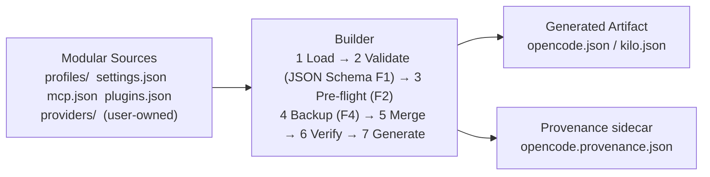
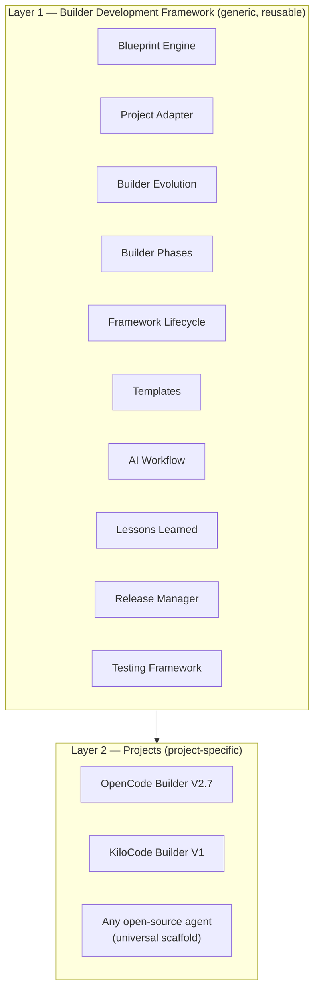
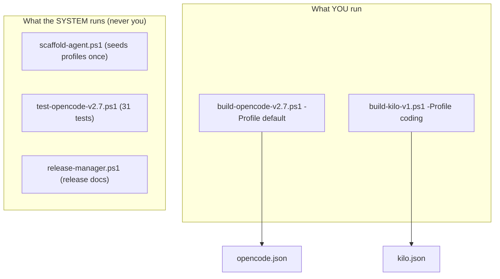

# ⚙️ Builder Development Framework (BDF)

> **Learn the engineering process once. Reuse it forever.**
>
> The reusable engineering platform that builds configuration builders for **any
> open-source coding agent** — currently powering **OpenCode** and **KiloCode**.

[-2ea44f)](#builder-v27-json-schema-validation)
[](#builder-development-framework)
[](#testing)
[](#releases)
[](#roadmap)

---

## 🚀 What Is This?

**BDF is a builder of builders.** It is both:

1. A **configuration builder** — a small automation system that turns messy,
   hard-to-maintain config files into clean, validated, reproducible outputs.
2. An **engineering framework** — the process, templates, adapters, and
   intelligence layer that make building such builders predictable and reusable.

It currently powers **two real projects** built on the same reusable framework:

| Project | What it builds | Builder |
|---------|----------------|---------|
| **OpenCode Configuration Manager** | `opencode.json` from modular sources | `build-opencode-v2.7.ps1` |
| **KiloCode Configuration Manager** | `kilo.json` from modular sources | `build-kilo-v1.ps1` |
| **AI Switcher (docs/app/)** | normal-user GUI app: scan → scaffold → build → one-click provider switching | `start.bat` + FastAPI backend + `gui.html` |

And the **V3 universal scaffold** can generate a builder for **any open-source
coding agent** with a local JSON config (Aider, Goose, Codex-Cli, ...) — not just
these two.

---

## 💡 Why Does This Exist?

Because hand-editing a giant JSON config is painful:

- One wrong key breaks the whole tool.
- Adding a provider means hunting through a huge file.
- MCPs, plugins, models, and settings all live in one fragile blob.
- There is no validation, no backup, no diff, no audit trail.

**BDF fixes this by separating one big file into small, modular, validated pieces:**



**You edit small files. The builder produces the big one — safely.**

---

## 🏗️ Architecture: Two Layers

The whole system is built on one principle: **generic knowledge lives in the
framework, project-specific knowledge lives in an adapter.**



**Layer 1 never depends on Layer 2.** Layer 2 depends on Layer 1. Only the
**Project Adapter** differs between supported projects — the framework itself
never gets redesigned per project.

---

## 🧩 What You Run vs What The System Runs

**You only ever run the builders.** Everything else is system/AI-run machinery.



---

## 🛠️ Quick Start

### Prerequisites

- Windows with **PowerShell 5.1+** (or PowerShell 7+)
- The target coding agent installed (OpenCode, KiloCode, ...)

### Build your configuration

**OpenCode:**

```powershell
cd C:\Users\loveb\.config\opencode\scripts
.\build-opencode-v2.7.ps1 -Profile default
```

**KiloCode:**

```powershell
cd C:\Users\loveb\.config\kilo\scripts
.\build-kilo-v1.ps1 -Profile coding
```

That's it. The builder:

1. Loads your profile + providers
2. Validates everything against **JSON Schemas** (F1)
3. Runs a **pre-flight dependency check** (F2)
4. **Backs up** the previous artifact (F4)
5. Merges settings → providers → models → plugins → MCP
6. Verifies the result before writing
7. Writes the artifact + a **provenance sidecar**

### Useful builder flags

| Flag | What it does |
|------|--------------|
| `-Profile <name>` | Which profile to build (`default`, `coding`, `experimental`, `minimal`) |
| `-WhatIf` | Dry run: validate + merge, **write nothing** (F3) |
| `-Doctor` | Read-only diagnostics of the real config (F6) |
| `-KeepBackups N` | Backup retention count, default 10 (F4) |
| `-ProvenancePath` | Sidecar output path (F5) |
| `-SchemaDir` | Schema directory (F1) |
| `-NonInteractive` | No prompts (CI-friendly) |

---

## 🗂️ How Configuration Is Organized

```
.config/
└── <agent>/
    ├── profiles/            ← YOU edit these
    │   ├── coding/          ← the MAIN profile (always)
    │   │   ├── settings.json          (framework-writable: $schema + activeProviders)
    │   │   ├── mcp.json               (user-owned after creation)
    │   │   ├── plugins.json           (user-owned after creation)
    │   │   └── <provider>-models.json (user-owned models)
    │   ├── experimental/    ← settings.json + EMPTY mcp/plugins
    │   └── minimal/         ← settings.json + EMPTY mcp/plugins
    ├── providers/           ← YOU own the JSON files inside (e.g. omniroute.json)
    ├── schemas/             ← JSON Schemas used for validation (F1)
    ├── scripts/             ← builder + test harnesses (system-run)
    ├── backup/              ← automatic timestamped backups (system-made)
    ├── <agent>.json         ← GENERATED artifact (never edit)
    └── <agent>.provenance.json  ← GENERATED sidecar (never edit)
```

**The rules:**

- 🔒 **Providers and models are 100% user-owned.** The framework creates the
  `providers/` folder but never writes files inside it. You create
  `providers/<id>.json` yourself.
- 🔑 **No-Secrets Rule (ULTIMATE):** the system's own artifacts (scripts,
  templates, docs, examples) **never contain a literal API key** — only
  `{env:VAR}` placeholders. Your files may contain your keys; you protect them.
  The system **copies your content verbatim** — it never invents keys.
- 🧬 **mcp.json / plugins.json are user-owned after creation.** The system seeds
  them once from the agent's own main JSON, then never overwrites them.
- 💾 **Backup-first:** before touching anything, the system backs up the previous
  state. You never have to worry.
- 🚫 **Never touch `.jsonc` without your consent.**

---

## 🧠 Builder V2.7 (JSON Schema Validation)

The current OpenCode builder implements 7 hardening features + 2 policies:

| Feature | What it does |
|---------|--------------|
| **F1** | JSON Schema validation of all config sources *before* builder validation |
| **F2** | Pre-flight dependency check — aborts on any missing input |
| **F3** | `-WhatIf` dry run — validates + merges, writes nothing |
| **F4** | Backup retention — prunes to the newest `-KeepBackups` (default 10) |
| **F5** | Provenance sidecar — `opencode.provenance.json`, never inside the config |
| **F6** | `-Doctor` — read-only diagnostics, exit 0 clean / 1 issues |
| **F7** | Merge diff summary vs the previous backup (Added/Removed/Updated) |
| **P1** | Env-key policy — builders never carry/restore/invent API keys |
| **P2** | Dynamic target artifact — `profiles/<profile>/target.json` can change the output name |

---

## 🧪 Testing

Four automated test harnesses keep the whole system green:

| Harness | Covers | Result |
|---------|--------|--------|
| `test-opencode-v2.ps1` | V2.1 builder + release pipeline | 17/17 ✅ |
| `test-opencode-v2.5.ps1` | Active-Provider Selector | 13/13 ✅ |
| `test-opencode-v2.7.ps1` | JSON Schema validation + hardening | 31/31 ✅ |
| `test-kilo-v1.ps1` | KiloCode builder | 30/30 ✅ |

Every builder build must pass the **Alpha → Beta → General Release** gates in
`bdf/BUILDER_PHASES.md` before it becomes the main builder.

---

## 📦 Releases

Releases follow a single automated, deterministic workflow:

1. The AI records release facts in `docs/release_registry.json` (the **only**
   hand-edited release artifact).
2. You review the facts.
3. The release manager generates all release documentation:

```powershell
powershell.exe -NoProfile -ExecutionPolicy Bypass -File scripts/release-manager.ps1
```

4. The test harnesses confirm the generated docs are consistent.
5. Commit.

Generated release files (`CHANGELOG.md` markers, `CURRENT_RELEASE.md`,
`bdf/VERSION.md` rows, `PROJECT_STATE.md` version table) are **never edited
manually** — reruns are byte-identical (deterministic).

---

## 🧭 Roadmap

**13 of 14 phases complete** toward **BDF V3** — the first stable public version
that generates builders for OpenCode, KiloCode, and any same-architecture
open-source coding agent. **Phase 13 (BDF V3) is still in progress — the best is
yet to come.**

| Phase | Status |
|-------|--------|
| Phase 1 — Foundation | ✅ |
| Phase 2 — Builder Improvements | ✅ |
| Phase 3 — Multiple Profiles | ✅ |
| Phase 4 — Additional Providers | ✅ |
| Phase 5 — Validation Framework | ✅ |
| Phase 6 — Automated Testing | ✅ |
| Phase 7 — Builder Refactoring | ✅ |
| Phase 8 — Documentation Expansion | ✅ |
| Phase 9 — Release Manager V1 | ✅ |
| Phase 10 — BDF V2.5 Framework Generalization | ✅ |
| Phase 10.5 — Active-Provider Selector Builder | ✅ |
| Phase 10.6 — JSON Schema Validation | ✅ |
| Phase 11 — Claude Code Builder V1 | ✅ resolved (dropped) |
| Phase 12 — KiloCode Builder V1 | ✅ |
| Phase 13 — BDF V3 Universal Builder Generator | 🔄 in progress |
| Phase 14 — GUI App (AI Switcher) | ✅ |

The journey is tracked live in `_agent/JOURNEY_TO_V3.md`.

---

## 📚 Documentation Map

The docs are split into two layers. **Framework** (generic, reusable) and
**project** (OpenCode-specific).

### Project documents

| Document | Description |
|----------|-------------|
| `AGENT.md` | AI agent entry guide — read order, rules |
| `ARCHITECTURE.md` | Overall system architecture |
| `BUILDER_SPEC.md` | Builder implementation specification (F1–F7, P1–P2) |
| `DEVELOPER_GUIDE.md` | How to work on the project (human onboarding) |
| `PROVIDER_DEVELOPMENT_GUIDE.md` | Creating user-owned provider definitions + models |
| `PROFILE_CREATION_GUIDE.md` | Creating and editing profiles |
| `BUILDER_EXTENSION_GUIDE.md` | Extending the builder |
| `FOLDER_STRUCTURE.md` | Directory and file responsibilities |
| `JSON_SCHEMAS.md` | Configuration file schemas |
| `TESTING.md` | Testing procedures |
| `TROUBLESHOOTING.md` | Common issues and fixes |
| `ROADMAP.md` | Planned future improvements |
| `CHANGELOG.md` | Project version history |
| `PROJECT_STATE.md` | Living state snapshot |
| `CURRENT_RELEASE.md` | Current release quick reference (generated) |
| `ADAPTER.md` | Project-specific facts (the adapter) |
| `app/` | The "AI Switcher" GUI app — self-contained, plain-language README inside |
| `release_registry.json` | Machine-readable release history (hand-edited) |

### Framework documents (`bdf/`)

| Document | Description |
|----------|-------------|
| `FRAMEWORK.md` | The complete engineering process |
| `BLUEPRINT_ENGINE.md` | The intelligence layer |
| `PROJECT_ADAPTER.md` | Making the framework project-specific |
| `BUILDER_EVOLUTION.md` | Creating future builder versions |
| `BUILDER_PHASES.md` | Alpha → Beta → General Release quality gates |
| `FRAMEWORK_LIFECYCLE.md` | Master lifecycle reference |
| `AI_WORKFLOW.md` | The AI agent workflow |
| `VERSION.md` | Framework versioning |
| `NEW_PROJECT_GUIDE.md` | Onboarding a new project |
| `RELEASE_MANAGER.md` | The generic release process |
| `TESTING.md` | The generic test-harness pattern |
| `LESSONS_LEARNED.md` | Reusable engineering lessons |
| `templates/` | 15 reusable documentation templates |

### Session & planning (`_agent/`, `planning/`, `AI/`)

| Document | Description |
|----------|-------------|
| `_agent/SESSION_WORKFLOW.md` | Session start/end/log rules |
| `_agent/SESSION_LOG.md` | Session history |
| `_agent/JOURNEY_TO_V3.md` | Live position on the road to V3 |
| `planning/BDF_ROAD_TO_V3.md` | The vision and definition of V3 |
| `planning/DECISIONS.md` | Permanent architectural decisions |
| `AI/` | Build plans, checkpoints, and continuation files |

---

## 🧭 Source of Truth

| Type | Files |
|------|-------|
| **Edit manually** | Provider definitions, profile config, docs, builder scripts, `release_registry.json` |
| **Generated, never edit** | `opencode.json`, `kilo.json`, `CURRENT_RELEASE.md`, CHANGELOG markers, PROJECT_STATE version table, `bdf/VERSION.md` compatibility rows |

All changes go to the **source files**; everything else is regenerated by the
builder or the release manager.

---

## 📜 Project Philosophy

- **Keep configuration modular.**
- **Avoid duplicated configuration.**
- **Separate implementation from configuration.**
- **Prefer automation over manual editing.**
- **Document everything that exists.**
- **Keep future ideas separate from completed features.**
- **Backup before you touch. Never write secrets. Copy verbatim.**

---

**Version:** 2.5.0
**Builder Version:** V2.7 (JSON Schema Validation)
**Framework Version:** 2.2.9
**Document Version:** 2.1

Documentation Status: Current Implementation
